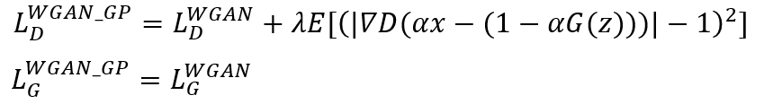
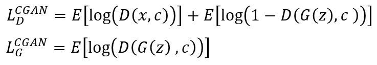
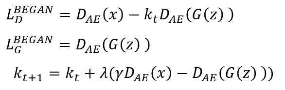

# NeuralTest

This repository holds scripts that was written by me for my Undergraduate Research Project on Solving Inverse Function Problem in Automatic Software Testing Tool.

One of the core interest of our research group is on Software Testing Tool and the project can be found [here](https://github.com/sunjun-group/Ziyuan). This project will leveraged on Generative Adversary Network (GAN) to improve existing methodology used by our research group in automatic software testing tool.

GANs are a type of artificial intelligence algorithms used in unsupervised machine learning, implemented by a system of two neural networks competing against each other in a zero-sum game framework. They were first introduced by Ian Goodfellow et al. in 2014.

## Generative Adversarial Networks (GANs)
## Lists  
*Name* | *Paper Link* | *Value Function*
:---: | :---: | :--- |
**GAN** | [Arxiv](https://arxiv.org/abs/1406.2661) | 
**LSGAN** | [Arxiv](https://arxiv.org/abs/1611.04076) | 
**WGAN** | [Arxiv](https://arxiv.org/abs/1701.07875) | 
**WGAN-GP** | [Arxiv](https://arxiv.org/abs/1704.00028) | 
**DRAGAN** | [Arxiv](https://arxiv.org/abs/1705.07215) | 
**CGAN** | [Arxiv](https://arxiv.org/abs/1411.1784) | 
**infoGAN** | [Arxiv](https://arxiv.org/abs/1606.03657) | 
**ACGAN** | [Arxiv](https://arxiv.org/abs/1610.09585) | 
**EBGAN** | [Arxiv](https://arxiv.org/abs/1609.03126) | 
**BEGAN** | [Arxiv](https://arxiv.org/abs/1702.08431) | 

## Why CGAN?
We apply an extension of generative adversarial networks in a conditional setting, CGAN. In the GAN framework, a “generator” is tasked with fooling a “discriminator” into believing that its own samples are real data. We add the capability for each network to condition on some arbitrary external data which describes the vector being generated or discriminated. By varying the conditional information provided to CGAN, we can use the resulting generative model to generate vectors with specific attributes from nothing but random noise. We evaluate the likelihood of vectors satisfying the predicate under the generative model, and examine how to deterministically control vectors attributes by modifying the conditional information provided to the model.

## CGAN structure

## Contributing changes

* See [CONTRIBUTING.md](CONTRIBUTING.md)

## Licensing

* See [LICENSE](LICENSE)
